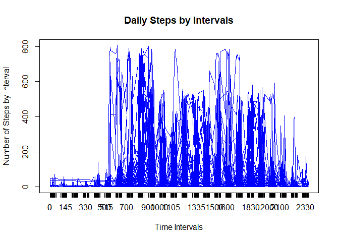

 This assignment makes use of data from a personal activity monitoring device.
 This device collects data at 5 minute intervals through out the day.
 The data consists of two months of data from an anonymous individual collected during the
 months of October and November, 2012 and include the number of stepstaken in 5 minute
 intervals each day.
 The variables included in this dataset are:
 steps: Number of steps taking in a 5-minute interval (missing values are coded as NA)
 date: The date on which the measurement was taken in YYYY-MM-DD format
 interval: Identifier for the 5-minute interval in which measurement was taken
 The dataset is stored in a comma-separated-value (CSV) file and
 there are a total of 17,568 observations in this dataset.


## Summary

The mean steps was calclated to be 37.826 and the median was calcuated to be 0 for the imputed data set and the data set with the NAs omitted. The 0615 interval on 11/27/2012 had the maximum steps of 806.  Based on the histograms the imputed data appears to have had a much greater frequency than the data with the NAs omitted.  This was eexpected since the number of observations was increased by 2304. The steps remained the same.  The steps pattern were different between the weekdays and weekends.  The most obvious difference was more steps taken at earlier intervals during the weekdays and more steps taken at later intervals during the weekend.

Add packages to execute script


```r
library(data.table)
```

```
## Warning: package 'data.table' was built under R version 3.4.2
```

```r
library(plyr)
```

```
## Warning: package 'plyr' was built under R version 3.4.2
```

```r
library(dplyr)
```

```
## Warning: package 'dplyr' was built under R version 3.4.2
```

```
## 
## Attaching package: 'dplyr'
```

```
## The following objects are masked from 'package:plyr':
## 
##     arrange, count, desc, failwith, id, mutate, rename, summarise,
##     summarize
```

```
## The following objects are masked from 'package:data.table':
## 
##     between, first, last
```

```
## The following objects are masked from 'package:stats':
## 
##     filter, lag
```

```
## The following objects are masked from 'package:base':
## 
##     intersect, setdiff, setequal, union
```

```r
library (tidyr)
```

```
## Warning: package 'tidyr' was built under R version 3.4.2
```

```r
library(stringr)
```

```
## Warning: package 'stringr' was built under R version 3.4.2
```

```r
library(graphics)
library(knitr)
```

```
## Warning: package 'knitr' was built under R version 3.4.2
```

 Load the function
 

```r
  data_analysis <- function()
  
  {     
      #Check to see if requred directory exists, if not create it.
    
      if(!file.exists("C:/Users/Sandrq/Documents/Reproducible"))
         {
              dir.create("C:/Users/Sandra/Documents/Reproducible")
         } 
  
  
      # download te data
    
      fileUrl <- "https://d396qusza40orc.cloudfront.net/repdata%2Fdata%2Factivity.zip"
      download.file(fileUrl, destfile = "C:/Users/Sandra/Documents/Reproducible/repdata_data_activity.zip", method = "libcurl")
      
      unzip("C:/Users/Sandra/Documents/Reproducible/repdata_data_activity.zip")
      
      #Process the data with the NA's removed
     
      activityData <- na.omit(read.csv("C:/Users/Sandra/Documents/Reproducible/RepData_PeerAssessment1/activity.csv")) 
      
      # Calculate the daily steps
      activityDataSteps <- group_by(activityData, date)
      activityDataSteps 
      
      # Create histogram representing the daily number of steps
      
    
      hist(activityDataSteps$steps,main = " Daily Steps", xlab = "Steps", col ="blue")
      
      
      # Caluculate the mean number of daily steps
      
      activityDataSteps1 <- summarize(activityDataSteps, Mean = mean(steps))
      activityDataSteps1  
      meanSteps <- mean(activityData$steps)
      print ("The mean steps are:")
      print (meanSteps)
      
  
     
      #Caluculate the median daily steps
      
      activityDataSteps2 <- summarize(activityDataSteps, Median = median(steps))
      activityDataSteps2        
      medianSteps <- (median(activityData$steps))
      print ("The median steps are:")
      print(medianSteps)
      
      
      
#Caluculate the interval steps
      
       activityDataSteps5 <- group_by(activityData, interval)
       
#A time series plot 5-minute interval (x-axis), average number of steps taken, averaged across all days (y-axis)
     
     plot(as.numeric(activityDataSteps5$interval),activityDataSteps5$steps, type = "l", main = "Daily Steps by Intervals", xlab = "Time Intervals", ylab = "Number of Steps by Interval", col = "blue")
      axis(1, at=as.numeric(activityDataSteps5$interval), labels = activityDataSteps5$interval)
      
   # The 5-minute interval, on average across all the days in the dataset, containing the maximum number of steps
   
print(" Time interval with Average Maximum Steps")
  
  (which.max(activityData$steps))
   print(activityData[14476,])
  
  
  #Impute missing data
  
  activityData2 <- (read.csv("C:/Users/Sandra/Documents/Reproducible/RepData_PeerAssessment1/activity.csv")) 
  activityData2$steps[which(is.na(activityData2$steps))] <- meanSteps # mean steps replace NA values
  
  
  #7. Create histogram representing the imputed daily number of steps
  
  
  hist(activityData2$steps,main = " Imputed Daily Steps", xlab = "Steps", col ="red")
  
  # calculate Imputed Mean and Median Steps
  
  print("Imputed mean steps")
  print(mean(activityData2$steps))
  
  print("Imputed Median Steps")
  print(median(activityData2$steps))
  
#8. Panel plot comparing the average number of steps taken per 5-minute interval across weekdays and weekends    
  activityfinal <- (read.csv("C:/Users/Sandra/Documents/Reproducible/RepData_PeerAssessment1/activity.csv")) 
  activityfinal$steps[which(is.na(activityfinal$steps))] <- meanSteps # mean steps replace NA values
  
 activityfinal$steps[which(is.na(activityfinal$steps))] <- meanSteps # mean steps replace NA values
  activityfinal$day <- weekdays(as.Date(activityfinal$date))
  activityfinalweekend<-activityfinal[activityfinal$day == c('Saturday','Sunday'),]
  activityfinalweekdays<- activityfinal[activityfinal$day == c('Monday','Tuesday','Wednesday','Thursday','Friday'),]
  
 
 
  (which.max(activityfinalweekend$steps))
  print("Maximum nuber of Steps during the weekend")
  print(activityfinalweekend[1972,])
  print(which.max(activityfinalweekdays$steps))
  print("Maximum nuber of Steps during the weekday")
  print(activityfinalweekdays[2378,])
  
  #Create Panel
  par(mfrow=c(2,1))
  plot(as.numeric(activityfinalweekend$interval),(as.numeric(activityfinalweekend$steps)), type = "l", main = "Weekend", xlab = "Time Intervals", ylab = "Number of Steps by Interval", col = "green")
  axis(1, at=as.numeric(activityfinalweekend$interval), labels = activityfinalweekend$interval)
  plot(as.numeric(activityfinalweekdays$interval),(activityfinalweekdays$steps), type = "l", main = "Weekday", xlab = "Time Intervals", ylab = "Number of Steps by Interval", col = "orange")
  axis(1, at=as.numeric(activityfinalweekdays$interval), labels = activityfinalweekdays$interval)

  
      #Calculate and report the total number of missing values in the data set
  
       activityData1 <- (read.csv("C:/Users/Sandra/Documents/Reproducible/RepData_PeerAssessment1/activity.csv")) 
      NAS <- sum(is.na(activityData1))
      print("The number of NA's are: ")
      print(NAS)
      
           
      
      
     
      
      
      
  }    
```


```r
data_analysis()
```

```
## Warning in dir.create("C:/Users/Sandra/Documents/Reproducible"): 'C:\Users
## \Sandra\Documents\Reproducible' already exists
```

```
## [1] "The mean steps are:"
## [1] 37.3826
```

```
## Warning: package 'bindrcpp' was built under R version 3.4.2
```

<!-- -->

```
## [1] "The median steps are:"
## [1] 0
```

<!-- -->

```
## [1] " Time interval with Average Maximum Steps"
##       steps       date interval
## 16492   806 2012-11-27      615
```

```
## [1] "Imputed mean steps"
## [1] 37.3826
## [1] "Imputed Median Steps"
## [1] 0
```

```
## Warning in activityfinal$day == c("Monday", "Tuesday", "Wednesday",
## "Thursday", : longer object length is not a multiple of shorter object
## length
```

<!-- -->

```
## [1] "Maximum nuber of Steps during the weekend"
##       steps       date interval    day
## 14024   785 2012-11-18     1635 Sunday
## [1] 2378
## [1] "Maximum nuber of Steps during the weekday"
##       steps       date interval     day
## 16492   806 2012-11-27      615 Tuesday
```

<!-- -->

```
## [1] "The number of NA's are: "
## [1] 2304
```
